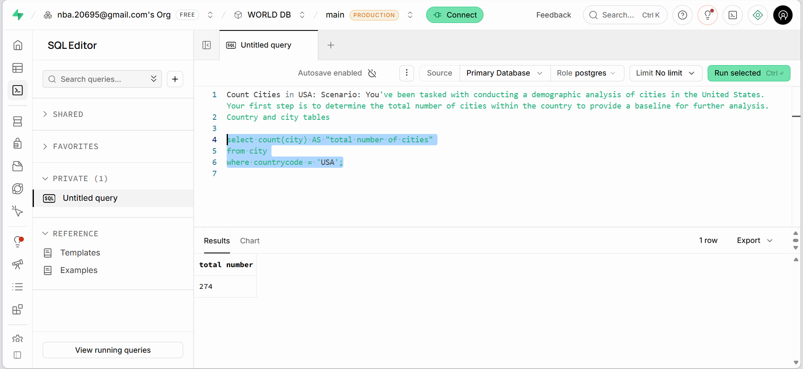
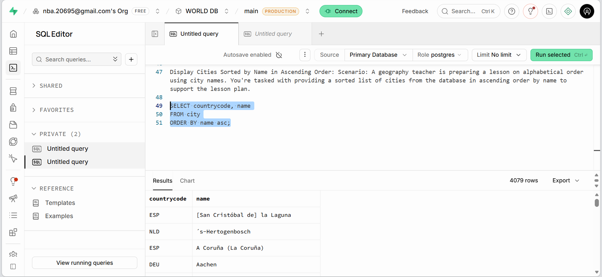
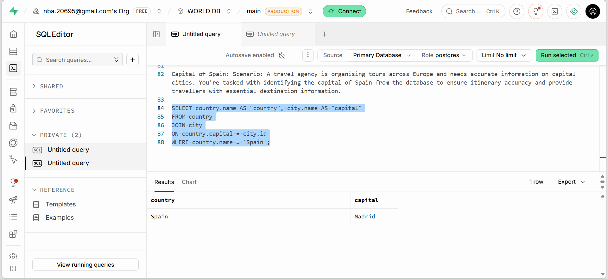

# 🗄️ SQL Data Analysis: Retail Insights & Database Design

Week 3 project from the Leep Data Technician Skills Bootcamp. Covers relational database design from scratch, then writing SQL queries against two real-world databases — Northwind (retail/sales) and World (geographic/demographic) — to answer specific business questions.

## 📝 Overview

Four parts, moving from database theory into hands-on querying:

- Designing a relational schema for a fictional company from a business scenario
- Writing filtering and sorting queries against Northwind's retail data (customers, products, orders)
- Learning and applying SQL JOIN types, then using them to combine Northwind's tables into full reports
- An 18-question SQL practical against a World database, covering aggregation, filtering, and joins on a different dataset

## 🧠 Skills Gained

- **SELECT and WHERE** – retrieving specific columns and filtering rows by exact match, ranges (`BETWEEN`), lists (`IN`), and multiple conditions (`AND`/`OR`)
- **ORDER BY** – sorting results ascending or descending, including combining a filter and a sort in the same query
- **GROUP BY** – aggregating rows into summaries, e.g. counting products per category
- **Table JOINs** – INNER, LEFT, RIGHT, FULL, and CROSS joins, both explained conceptually and written as working multi-table queries (up to three tables in one query)
- **Relational database design** – identifying entities, primary/foreign keys, and one-to-many relationships from a business scenario
- **Relational vs. non-relational databases** – reasoning about when structured (SQL) vs. flexible (NoSQL) storage fits the data

## 🗂️ Task Breakdown

### Database Design — SkillUp Academy
Working from a business scenario for a fictional training company, designed a 4-table relational schema:

- `Learner` (PK: Learner ID) — name, date of birth, contact details, Course ID (FK)
- `Course` (PK: Course ID) — name, duration, cost, Trainer ID (FK)
- `Trainer` (PK: Trainer ID) — name, contact details, Course ID
- `Enrolment` (PK: Enrolment ID) — Learner ID (FK), Course ID (FK), start/end dates

Also compared relational vs. non-relational databases for a related scenario — identifying that unstructured data like user comments and uploaded documents (variable format, variable size, frequently changing structure) suits a non-relational database better than a rigid table schema.

### Retail Queries — Northwind Database
Wrote a series of queries against Northwind's `Customers`, `Products`, and `Orders` tables in MySQL Workbench to answer specific business requests:

```sql
-- High-value products report: products priced over £50
SELECT *
FROM products
WHERE price > 50;

-- Mid-range products, priced between £20 and £50, most expensive first
SELECT *
FROM products
WHERE Price between 20 and 50
ORDER BY Price desc;

-- Recent orders report, most recent first
SELECT *
FROM Orders
ORDER BY OrderDate DESC;
```

### SQL JOINs — Theory and Application
Explained each JOIN type in plain English with a real scenario for when to use it (e.g. LEFT JOIN to list all courses including ones with no enrolments yet, INNER JOIN to see only learners actually enrolled on a course), then applied that to Northwind:

```sql
-- Supply chain overview: product, category, and supplier in one report
SELECT productname, categoryname, suppliername
FROM products
JOIN categories
ON products.categoryid = categories.categoryid
JOIN suppliers
ON products.supplierid = suppliers.supplierid;

-- Product count by category
SELECT categoryname, COUNT(products.productid) AS product_count
FROM products
JOIN categories
ON products.categoryid = categories.categoryid
GROUP BY categoryname;
```

### SQL Practical — World Database
Set up a World database (countries, cities, languages) in Supabase and wrote 18 queries answering demographic and geographic questions, each captured with a screenshot of the code and result together:







The 18 questions covered counting and filtering (e.g. 274 cities in the USA, cities with population over 2 million), sorting and limiting (top 10 most populous cities, cities ranked 31st–40th), pattern matching (cities starting with "Be", cities containing "New"), joining tables (looking up each country's capital city, e.g. Spain → Madrid), and grouping (average population by country, frequency of repeated city names).

## 🛠️ Tools

MySQL Workbench, Supabase (PostgreSQL), Northwind sample database, World sample database

## 🎓 About

Completed as part of Week 3 (Databases & SQL) of the [Leep Talent Data Technician Skills Bootcamp](https://leepgroup.com), August 2026.
